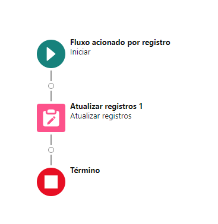

# Black Panther - Salesforce Implementation
---

## 1. Painéis na Home Início

### Criação da Nova Conta

### Criação do Novo Contato

### Descrição:
- Exibir todos os painéis disponíveis na home início.
- Esses painéis fornecem uma visão geral das principais métricas e indicadores de desempenho da Black Panther.

---
## 2. Despesas Black Panther
### Regras de Negócio:
- **Não pode ser negativo**: O valor da despesa não pode ser negativo.
- **Valor máximo**: O valor da despesa não pode ser maior que R$10.000.

### Processo de Aprovação:
1. Após a criação do registro de despesa, o mesmo deve ser enviado para um processo de aprovação.
2. Atualizar o status para "Em Análise" logo após o envio para aprovação.

---

## 3. Oportunidades Black Panther
### Exibição:
- Mostrar todas as possíveis oportunidades da Black Panther.

### Fluxo de Aprovação:

- **Aprovação de valores**: O valor da oportunidade deve ser maior que R$25.000 para ser encaminhado para aprovação.
- **Fechar Negócio**: Caso o valor seja inferior a R$25.000, a oportunidade deve ser enviada para "Fechar Negócio".

---

## 4. Contratos Black Panther
### Exibição:
- Mostrar todos os contratos da Black Panther.

### Fluxo de Alerta:

- Receber um alerta antes do vencimento do prazo do contrato.

---

## 5. Produtos Black Panther
### Exibição:
- Exibir todos os produtos cadastrados.

---

## 6. Leads Black Panther
### Exibição:
- Exibir todos os Leads que foram captados.

---

## 7. Lead Qualificado
### Regras de Qualificação:
- Verificar se o Lead é qualificado de acordo com o país:
  - **Países não qualificados**: Argentina, Brasil, China, Chile ou Japão.

### Fluxo para Lead Desqualificado:

- Iniciar um fluxo específico para leads desqualificados.

---

## 8. Tarefas Black Panther
### Exibição:
- Exibir todas as tarefas em aberto relacionadas aos leads.
- Filtrar as tarefas com o assunto "Tentar conversão nos próximos 5 dias".

### Fluxo de Tarefas:

- Tenta conversão do lead nos proximos 5 dias