<h1 align="center"><strong>Projeto de Treinamento Salesforce: “TechCorp CRM Avançado”</strong></h1>

<h2 align="center"><strong>Introdução</strong></h2>

  A TechCorp é uma empresa fictícia de tecnologia que desenvolve soluções inovadoras para o mercado de CRM. Recentemente, a empresa decidiu migrar seu sistema de gerenciamento de clientes para a plataforma Salesforce. Como parte do treinamento, os desenvolvedores serão responsáveis por configurar e customizar o Salesforce para atender às necessidades específicas da TechCorp.

<h2 align="center"><strong>O Projeto</strong></h2>

<h3><strong>1. Back End</strong></h3>

- Desenvolver classes Apex para lógica de negócios complexa.
- Implementar integrações com sistemas externos usando APIs RESTful.

<h3><strong>2. DML (Data Manipulation Language)</strong></h3>

- Realizar operações DML (inserção, atualização, exclusão) em registros Salesforce.
- Utilizar SOQL e SOSL para consultas eficientes.

<h3><strong>3. Classes e Classes de Teste</strong></h3>

- Criar classes Apex para encapsular a lógica de negócios.
- Desenvolver classes de teste para garantir a cobertura de código e a qualidade do software.

<h3><strong>4. Triggers</strong></h3>

- Implementar triggers para automatizar processos de negócios.
- Garantir que os triggers sejam eficientes e evitem loops recursivos.

<h2 align="center"><strong>Estrutura do Projeto</strong></h2>

<h3><strong>1. Configuração Inicial</strong></h3>

- Criação de objetos personalizados: Cliente, Produto, Pedido.

- Criar Cliente.

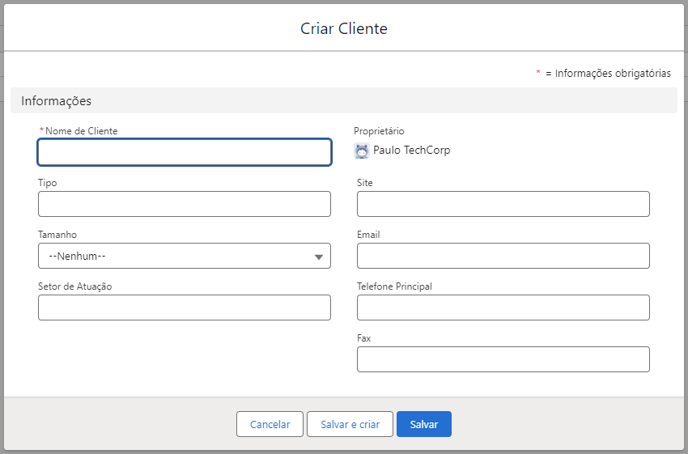

- Criar Produto.

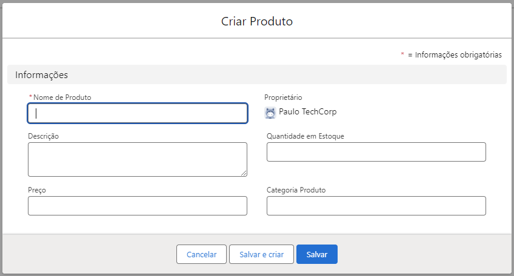

- Criar Pedido.

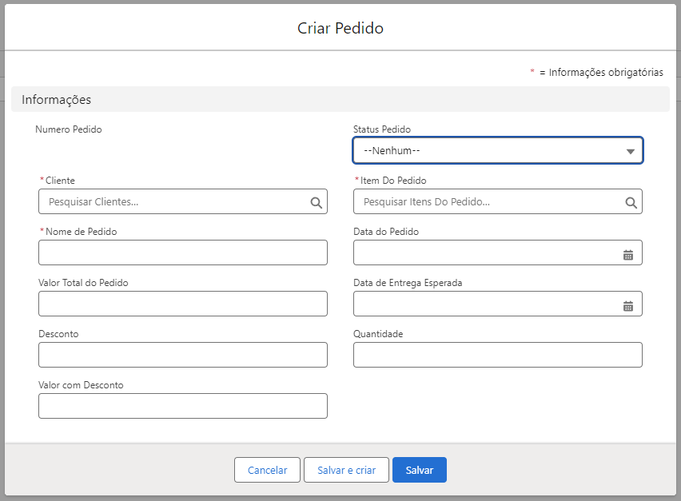

- Criar Transação

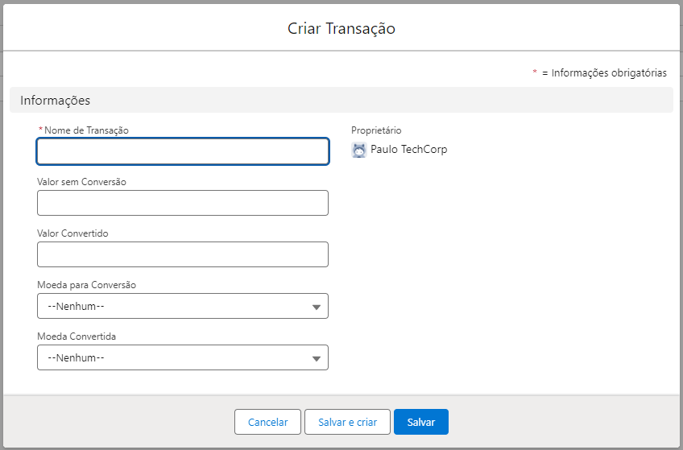

- Criar Item do Pedido

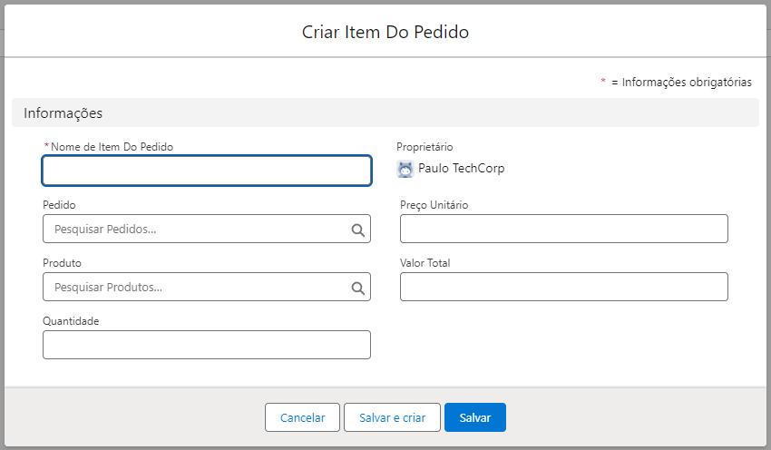

- Criar Projeto

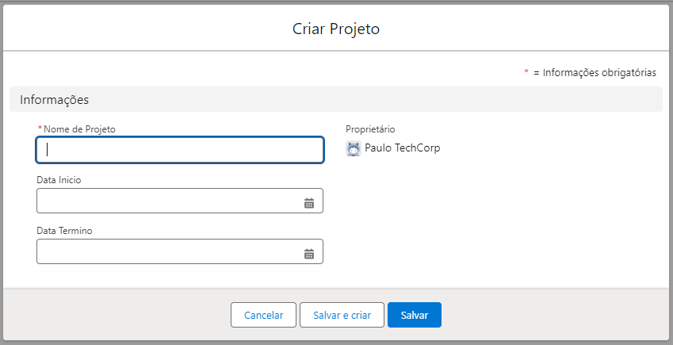

<h3><strong>2. Desenvolvimento de Classes Apex</strong></h3>

- Classe `ClienteService` para gerenciar operações relacionadas a clientes.

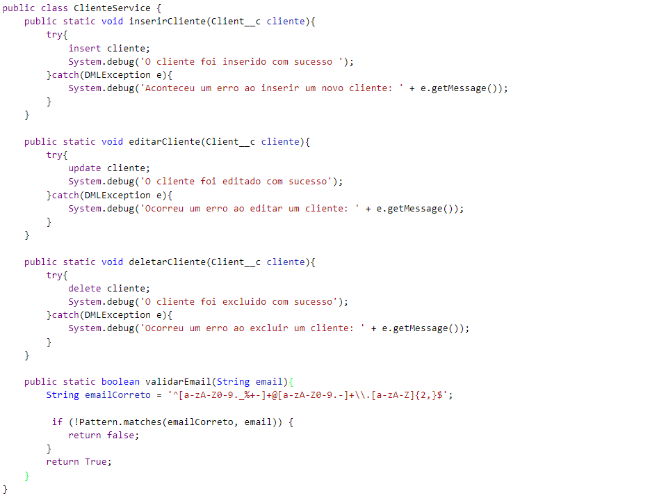

- Classe `PedidoService` para lógica de negócios de pedidos.

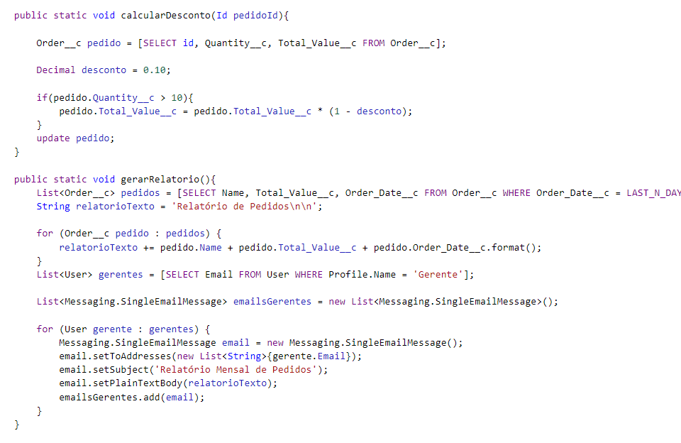

<h3><strong>3. Implementação de Triggers</strong></h3>

- Trigger `ClienteTrigger` para validar dados de clientes antes da inserção.

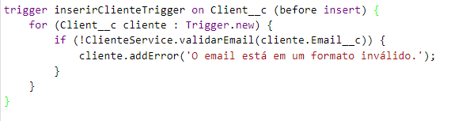

- Trigger `PedidoTrigger` para atualizar o estoque de produtos após a criação de um pedido.

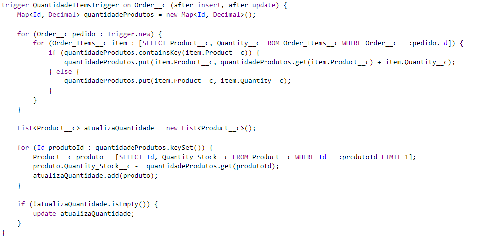

<h2 align="center"><strong>Problemas Avançados para Resolução com Código Apex</strong></h2>

<h3><strong>1. Validação de Email</strong></h3>

- **Problema**: Verificar se o campo de email em um objeto Contato é válido e pertence a um domínio específico (por exemplo, @empresa.com).
- **Solução**: Desenvolver uma classe Apex que valide o formato do email e o domínio.

<h3><strong>2. Cálculo de Desconto</strong></h3>

- **Problema**: Calcular um desconto baseado na quantidade de produtos comprados. Se a quantidade for maior que 10, aplicar um desconto de 10%.
- **Solução**: Criar uma classe Apex que calcule o desconto e atualize o campo Desconto no objeto Pedido.

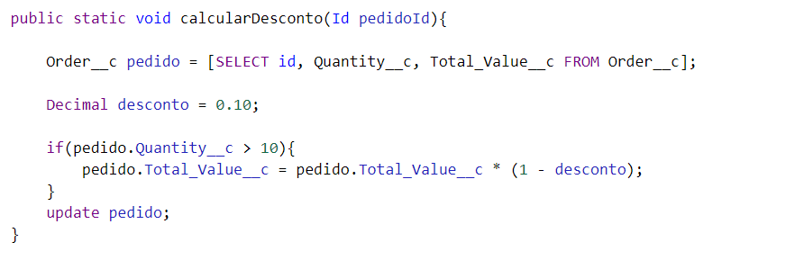

<h3><strong>3. Conversão de Moeda</strong></h3>

- **Problema**: Converter valores de uma moeda para outra usando uma taxa de câmbio fornecida.
- **Solução**: Desenvolver uma classe Apex que faça a conversão de moeda e atualize o campo ValorConvertido no objeto Transação.

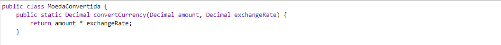
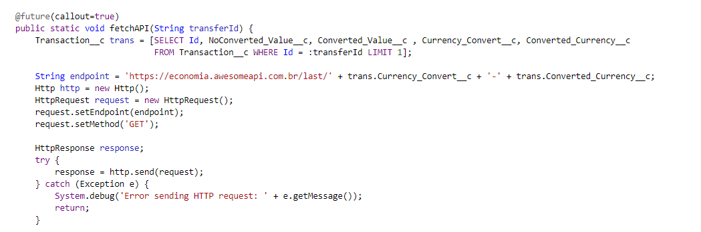
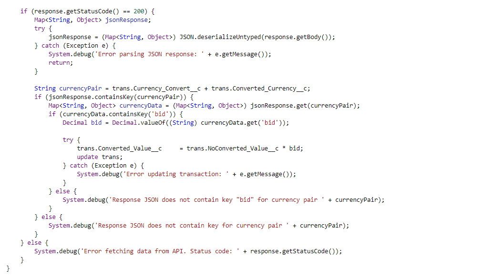

<h3><strong>4. Geração de Relatórios</strong></h3>

- **Problema**: Gerar um relatório mensal de vendas e enviar por email aos gerentes.
- **Solução**: Implementar uma classe Apex que gere o relatório e utilize o serviço de email do Salesforce para enviar o relatório.

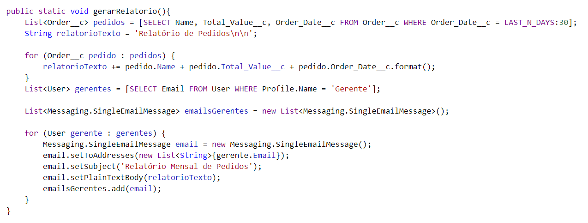

<h3><strong>5. Atualização de Endereço</strong></h3>

- **Problema**: Atualizar automaticamente o endereço de todos os contatos associados a uma conta quando o endereço da conta é atualizado.
- **Solução**: Desenvolver uma classe Apex que atualize os endereços dos contatos com base no endereço da conta.

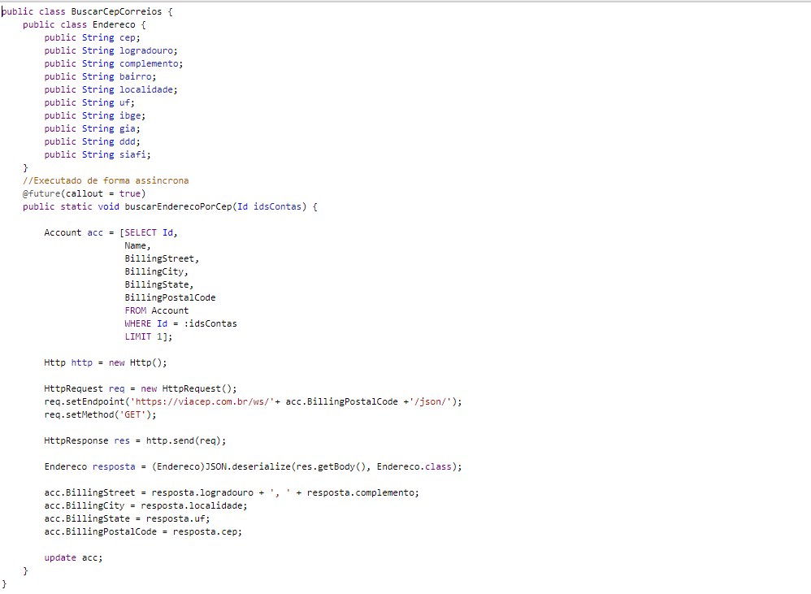

<h2 align="center"><strong>Problemas com Triggers</strong></h2>

<h3><strong>1. Trigger de Atualização de Status</strong></h3>

- **Problema**: Atualizar o status de um Caso para “Fechado” quando a data de resolução é preenchida.
- **Solução**: Implementar um trigger que verifique a data de resolução e atualize o status do caso.

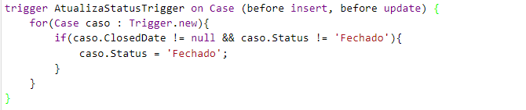

<h3><strong>2. Trigger de Notificação de Oportunidade</strong></h3>

- **Problema**: Enviar uma notificação ao gerente de vendas quando uma oportunidade é fechada com sucesso.
- **Solução**: Desenvolver um trigger que envie uma notificação quando o campo Status da oportunidade for atualizado para “Fechado - Ganhou”.

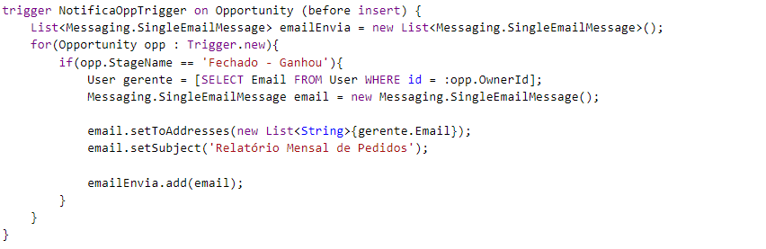

<h3><strong>3. Trigger de Atualização de Inventário</strong></h3>

- **Problema**: Atualizar o inventário de produtos quando um pedido é criado ou atualizado.
- **Solução**: Implementar um trigger que ajuste a quantidade de produtos no inventário com base nos pedidos.

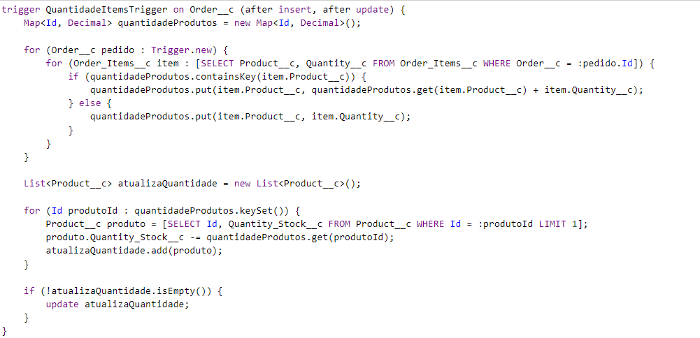

<h3><strong>4. Trigger de Validação de Data</strong></h3>

- **Problema**: Garantir que a data de início de um projeto seja anterior à data de término.
- **Solução**: Desenvolver um trigger que valide as datas de início e término de um projeto.

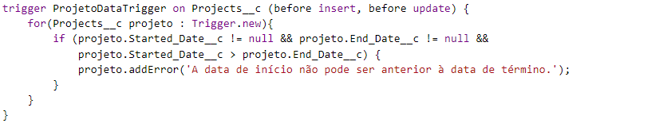

<h3><strong>5. Trigger de Criação de Tarefas</strong></h3>

- **Problema**: Criar automaticamente uma tarefa de acompanhamento quando um lead é convertido em contato.
- **Solução**: Implementar um trigger que crie uma tarefa de acompanhamento ao converter um lead.

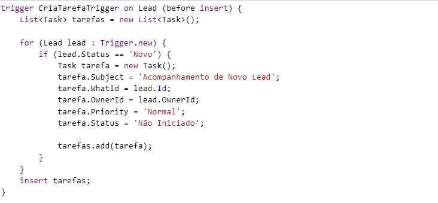

<h2 align="center"><strong>Tema Extra: Integração com API de CEP dos Correios</strong></h2>

<h3><strong>Objetivo</strong></h3>

Realizar a conexão com a API de CEP dos Correios para buscar informações de endereço.

<h3><strong>1. Desenvolvimento da Classe Apex</strong></h3>

- Classe Apex para realizar chamadas HTTP à API dos Correios.

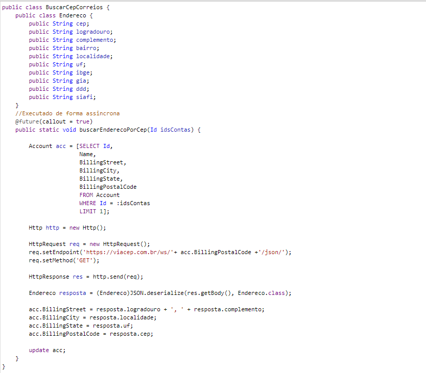

<h3><strong>2. Melhorias com Mais Tempo</strong></h3>

- Realizaria uma configuração mais adequada na parte da organização.
- Me aprofundaria na parte de testes, garantindo que todas as classes estejam funcionando perfeitamente.
- Realizaria uma refatoração da documentação.
