# 🌐 DBC - Salesforce

# Fluxo 1 - Vendas

## ☑️ Objetivo

Modernizar a gestão, mantendo a rastreabilidade e controle de
operações, e integrando sistemas globais de vendas e logística com processos automatizados no Salesforce.

### ❕ Escopo Principal

#### 📦 Objetos Customizados

##### 🏳️ 1. País
O objeto **País__c** foi criado para representar os países em que a empresa opera ou tem clientes. Ele armazena informações essenciais, como sigla, moeda e idioma para cada país, permitindo um gerenciamento centralizado dos dados regionais.

   - **Campos:**
     - **Sigla__c (Texto, Obrigatório, Único):** Representa a sigla oficial do país (por exemplo, BR para Brasil, US para Estados Unidos). Este campo é obrigatório e deve ser único, evitando duplicações de registros.
     - **Moeda__c (Texto):** Armazena a moeda oficial do país (por exemplo, BRL para Brasil, USD para Estados Unidos).
     - **Idioma__c (Texto):** Define o idioma predominante do país (por exemplo, Português, Inglês). Esse campo é útil para personalizar a comunicação com os clientes de acordo com a sua localização.

##### 🛍️ 2. Despesa
O objeto **Despesa__c** foi criado para gerenciar as despesas da empresa, permitindo o acompanhamento e controle financeiro. Ele inclui validações e condições para garantir que as despesas sejam registradas corretamente e aprovadas pelo setor financeiro.

   - **Campos:**
     - **Valor__c (Número):** Armazena o valor da despesa. Esse campo possui uma validação para impedir a inserção de valores negativos ou valores superiores a R$ 59.785. Isso garante o controle de grandes despesas e evita erros de lançamento.
     - **Aprovado__c (Checkbox):** Este campo indica se a despesa foi aprovada pelo setor financeiro. Apenas despesas aprovadas podem prosseguir para pagamento.
     - **DataPagamento__c (Data):** Este campo aparece condicionalmente, somente após a despesa ser aprovada. Ele armazena a data em que o pagamento da despesa foi efetuado, permitindo um acompanhamento preciso do fluxo de caixa.

##### 👨‍💼 3. Campos em Conta

- **Campos:**
    - **TotalVendas__c:** Valor total das vendas feitas para essa conta.
    - **Pais__c:** Relacionamento obrigatório com o objeto País__c.
    - **ResumoPais__c:** Campo que exibe o resumo do país no seguinte formato:
    - **N:** Nome (Com N/A caso algum valor esteja faltando)
    - **S:** Sigla (Com N/A caso algum valor esteja faltando)
    - **I:** Idioma (Com N/A caso algum valor esteja faltando)
    - **M:** Moeda (Com N/A caso algum valor esteja faltando)

#### 🤖Funcionalidades de Automação

##### 🛍️ 1. Trigger em Despesa

##### 🚏 2. Endpoint Customizado

- **Desafio:** Implementar um endpoint customizado para realizar o upsert de uma Conta e implementar um endpoint customizado para realizar o insert de um Pedido

- **Solução:** A solução para o desafio, foi realizar a criação dos endpoints utilizando Apex e seus recursos Http, implementando o contrato de entrada e de saída esperados através de JSON.

###### 2.1 Upsert de Conta
Houve a criação de um endpoint para criar ou atualizar (upsert) uma conta através do seu ID Externo.

A rota é `https://dbccompany29-dev-ed.develop.my.salesforce.com/services/apexrest/Account/:externalId`

Ela espera receber um JSON com os seguintes campos:
```JSON
{
    "name": "João",
    "country": "Brasil"
}
```

Existem 2 respostas possíveis:
- 201 Created:
```JSON
{
    "id": "001ak00000Xg7i1AAB", 
    "name": "João", 
    "countryId": "a00ak00000JSMFcAAP", 
    "externalId": "0012w00000X9xyzAAA"
}

```

- 400/500 Error:

```JSON
{
    "erro": "string"
}
```

###### 2.2. Insert de Pedido

Esse segundo endpoint, é responsável por realizar a criação de um pedido.

A rota é https://dbccompany29-dev-ed.develop.my.salesforce.com/services/apexrest/Order/
Ela espera receber um JSON com os seguintes campos:

```JSON
{
    "contractNumber": "00000100",
    "accountName": "Teste 34",
    "startDate": "2024-09-14"
}
```

Existem 2 respostas possíveis:
- 201 Created:
```JSON
{
    "id": "801ak00000XgCzRAAV", 
    "accountId": "001ak00000XbI7pAAF", 
    "contractId": "800ak00000JTDPMAA5", 
    "effectiveDate": "2024-09-14 00:00:00"
}
```

- 400/500 Error:
```JSON
{
    "erro": "string"
}
```

##### 📩 3. Automação de Email
A automação de envio de emails foi implementada para garantir que um email seja disparado automaticamente sempre que uma conta (**Account**) for criada ou editada. Para tornar essa funcionalidade flexível e gerenciável, foi criada uma interface gráfica onde os administradores podem configurar o endereço de email e habilitar ou desabilitar o envio de emails diretamente via interface.

**Componentes Utilizados:**
1. **Componente LWC: `EmailConfigComponent`**

   O **`EmailConfigComponent`** é o componente responsável por exibir e gerenciar as configurações de email na interface do usuário. Ele permite que o usuário defina o endereço de email e habilite ou desabilite o envio de emails.
   
   - **Tela de Configuração:** O componente LWC exibe dois campos principais:
     - Campo para o endereço de email destinatário.
     - Checkbox para habilitar/desabilitar o envio de emails.
     
    <div align="center">
    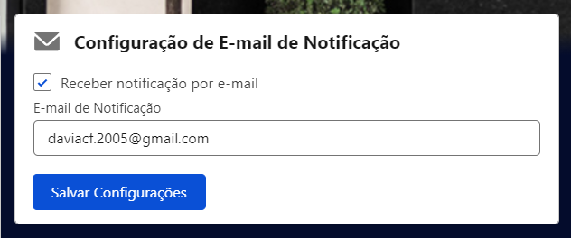
    </div>
    
2. **Controlador Apex: `AccountSettingsController`**
   O **`AccountSettingsController`** é o controlador Apex que gerencia a lógica por trás das configurações do componente LWC. Ele salva e recupera as configurações de envio de email (endereço de email e status de ativação/desativação) através de uma consulda SOQL e operacão DML.
   
   **Principais métodos:**
   - `getAccountSettings()`: Retorna as configurações atuais de email (endereço e status).
   - `saveAccountSettings(Id accountId, String emailNotificacao, Boolean ativarEnvioEmail)`: Atualiza as configurações de email com base nas alterações feitas na interface.

3. **Trigger: `AccountEmailTrigger`**
   A **`AccountEmailTrigger`** é a trigger que é executada após a criação ou edição de uma conta. Ela verifica se o envio de email está habilitado e, caso esteja, envia o email para o endereço configurado.

   **Descrição da Trigger:**
   - Executada após os eventos `after insert` e `after update` em **Account**.
   - Verifica se o envio de email está habilitado através das configurações armazenadas.
   - Dispara o envio de um email para o endereço definido na configuração, informando que uma nova conta foi criada ou editada.

   <div align="center">
    
    </div>
     
##### 💹 4. Automação de Total de Vendas

- **Desafio:** Implemente uma automação sem utilizar código para que, sempre que uma nova Order seja criada, o campo TotalVendas__c da conta relacionada seja incrementado do valor da Order.

- **Solução:** Criação de 3 fluxos que executam a adição de valores, remoção de valores e atualização de valores caso a quantidade de produtos de um tipo seja alterada. Quando uma nova Order for criada, caso seja adicionado um produto, esse valor sera incrementado no campo `TotalVendas__c`, caso o pedido seja excluído, será subtraído e por último, se eu pegar um produto de um tipo e alterar a quantidade dele, será subtraído o valor do produto anteriormente e incrementado o novo valor.

##### 🗑 5. Processo de Deleção de Orders

- **Desafio:** Implementar um processo para excluir Pedidos com data de modificação superior a 3 meses atrás. Garantindo que milhões de registros possam ser gerenciados em cada execução, sem sobrecarregar os limites da plataforma.

- **Solução:** Foi criado um código definindo a data limite para 3 meses, juntamente com uma lista que busca as Orders que foram modificadas há mais de 3 meses.

#### 🧑 6. Trigger em Lead

- **Desafio:** Criar uma tarefa automática ao mudar o status de Lead para “Em process de conversão” para “Interessado” com o assunto “Tentar a conversão nos próximos 5 dias”

- **Solução:** O código cria uma tarefa automaticamente quando o status do Lead muda de "Em Processo de Conversão" para "Interessado", com um prazo de 5 dias. Isso está de acordo com o requisito mencionado.

<div align="center">
    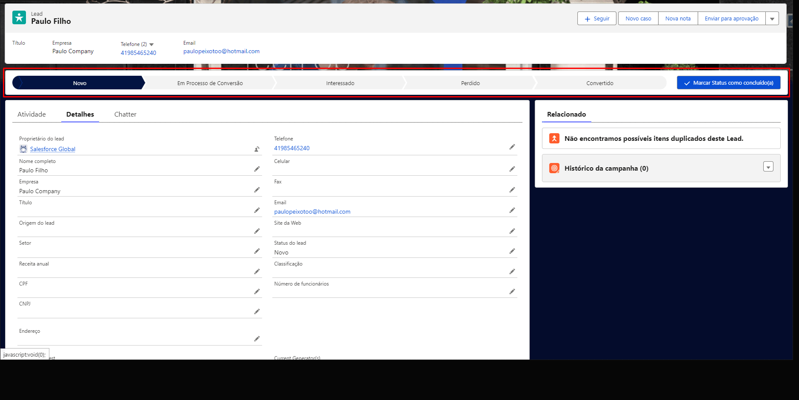
</div>

##### 🏠 7. Utilização de API para busca de CEP

- **Desafio:** Integrar uma API de busca de CEP ao Salesforce para preencher automaticamente os campos de endereço ao cadastrar ou editar um cliente.

- **Solução:** Criação de uma trigger que ao ser editado/criado um *Contato* com o CEP (MailingPostalCode) com 8 ou 9 digítos é realizado uma chamada de api para ViaCEP, envianndo o número e esperando receber o endereço.

A chamada acontece através da classe `CEPQueuable`, que implementa a interface `Queueable` e `Database.AllowsCallouts`, enviando um HTTP GET para `https://viacep.com.br/ws/:cep/json/` e recebendo a resposta em um JSON que será deserializado e seus valores serão colocados no contato.

Além disso, foi confeccionado a classe de Testes da classe e da Trigger e um HttpMock, para que seja possível realizar os testes.

<div align="center">
    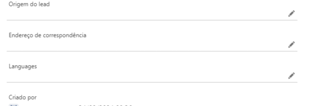
</div>

2. **Controlador Apex: `AccountSettingsController`**
   O **`AccountSettingsController`** é o controlador Apex que gerencia a lógica de negócios por trás das configurações do componente LWC. Ele salva e recupera as configurações de envio de email (endereço de email e status de ativação/desativação) em um objeto customizado de configuração ou Custom Metadata.
   
   **Principais métodos:**
   - `getEmailSettings()`: Retorna as configurações atuais de email (endereço e status).
   - `saveEmailSettings(String email, Boolean isEnabled)`: Atualiza as configurações de email com base nas alterações feitas na interface.
#### 🛍️ Gestão de Despesas

#### 👪 Captura e Gestão de Leads

- **Desafio:**
    * Leads devem ter origens distintas: site, redes sociais e lista adquirida.
    * Dependendo da origem, leads devem ser encaminhados para filas
específicas de atendimento.
    * Os leads precisam passar por diferentes etapas de status: Novo, Em Processo de Conversão, Interessado, Convertido, Perdido.
    * Leads de 13 estados brasileiros (ex.: São Paulo, Rio de Janeiro, Minas Gerais, etc.) devem ser desqualificados automaticamente.
    * Lead não pode ser convertido sem CNPJ válido.
    * Tarefas devem ser criadas automaticamente quando o status de lead mudar de “Em Processo de Conversão” para “Interessado”

- **Solução:**
    * O campo de Origem do Lead foi alterado para receber `Site, Redes Sociais, Lista Adquirida`.
    * Foram criadas 3 filas `Fila Lista Adquirida, Fila Rede Social, Fila Site` e uma regra de atribuição de lead `Lead Source`. Sendo opcional a atribuição para a fila.
    * Os Leads tem os status de lead `Novo, Em Processo de Conversão, Interessado, Convertido, Perdido.`.
    * Leads dos estados `'São Paulo', 'Rio de Janeiro', 'Minas Gerais', 'Bahia', 'Paraná', 'Rio Grande do Sul', 'Santa Catarina', 'Pernambuco', 'Ceará', 'Goiás', 'Espírito Santo', 'Pará', 'Mato Grosso'` são enviados para o status `Perdido` automaticamente.
    * Se tentar converter sem o CNPJ, é impedido. No Before Insert, é feita uma validação do CNPJ. Também tem a opção de adicionar o CPF e é feita a mesma validação.
    * Quando o status muda de `Em Processo de Conversão` para `Interessado`, é criado uma nova task.


#### 💹 Oportunidades

- **Desafio:**
    * Oportunidades devem passar pelas fases: nova oportunidade, proposta de valor, negociação, revisão, negócio fechado, negócio perdido.
    * Oportunidades superiores a R$ 37.000 precisam passar por um processo de aprovação antes de serem fechadas.
    * Não é possível voltar atrás em uma fase de oportunidade.
    * Oportunidades devem ter produtos da “Global” para serem negociadas.
    * Oportunidades criadas só podem ser vistas pelo criador, mas o CEO pode ver todas.
    * Email de proposta comercial enviado automaticamente ao cliente na fase “Proposta de Valor”.

- **Solução:**
    * Oportunidades tem novos estágios `Nova Oportunidade, Proposta de Valor, Negociação, Revisão, Negócio Fechado, Negócio Perdido.`.
    * Caso a oportunidade seja maior que R$ 37.000,00 é acionado um fluxo que ativa o processo de aprovação enviado no e-mail para pessoas que estão no papel de `Financeiro` e também notifica o dono da oportunidade por notificação que sua oportunidade foi enviada para processo de aprovação.
    * Criado um trigger que impede que volte atrás em uma fase e também é necessário avançar fase por fase. Também não é possível entrar na fase de negociação sem ter um valor.
    *Assim que está na fase de negociação, é enviado um e-mail para o primeiro conttato na conta associada, informando o valor.
    * Apenas pode ser adicionado produtos da famílias


#### 🧾 Contratos
**Objetivo**
O objetivo deste módulo é gerenciar a **renovação dos contratos** com lojas parceiras, garantindo que a equipe responsável seja notificada sempre que um contrato estiver próximo de vencer, permitindo a renovação de forma proativa.

**Regras de Negócio**
- **Alerta de Renovação Próximo ao Vencimento:** Todos os contratos devem ter um alerta de renovação configurado, que será disparado quando a data de vencimento estiver próxima. Isso garante que a equipe de contratos possa tomar as devidas providências para a renovação em tempo hábil, evitando lapsos ou cancelamentos indesejados.

#### **Automação do Alerta de Renovação**
Para implementar o alerta de renovação dos contratos, foram desenvolvidas duas classes: **ContractRenewalAlert** e **ContractRenewalAlertScheduler**.


A classe **`ContractRenewalAlert`** é responsável por verificar os contratos que estão próximos do vencimento e enviar o alerta apropriado. A lógica implementada nesta classe percorre os registros de contratos no Salesforce e identifica aqueles cujo prazo de vencimento está próximo, disparando um alerta para a equipe responsável.

**Agendamento da Tarefa**

O agendamento da tarefa é feito para que o processo de verificação e envio de alertas seja executado automaticamente todos os dias às 08:00. Para isso, utilizamos o método **System.schedule** com uma expressão cron, conforme o código abaixo:

```apex
String cronExp = '0 0 8 * * ?'; // Executar às 08:00 todos os dias
ContractRenewalAlertScheduler job = new ContractRenewalAlertScheduler();
System.schedule('Alerta de Renovação de Contratos', cronExp, job);
```

- **Cron Expression:** A expressão `'0 0 8 * * ?'` significa que o job será executado **todos os dias às 08:00**, garantindo que os alertas de renovação sejam disparados diariamente, logo no início do expediente.
- **Nome da Tarefa:** A tarefa foi nomeada como **"Alerta de Renovação de Contratos"** no sistema de agendamento do Salesforce, facilitando a sua identificação no futuro.


#### 🔎 Casos

- **Desafio:** Criar um formulário utilizando Web-To-Case para registrar casos de forma automática, eles devem ser separados em filas de atendimento (Central Telefônica/Central Digital) e ao finalizar o caso deverá ser enviada uma pesquisa de satisfação automática ao e-mail do cliente.

- **Solução:** Criado um formulário para receber os casos por `Web-To-Case`. Eles são enviados com a origem `Phone` e passam por um flow para serem atribuídos a fila `Central Telefônica`.

<div align="center">
    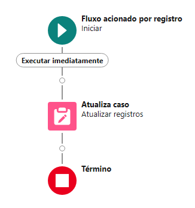
</div>

<div align="center">
    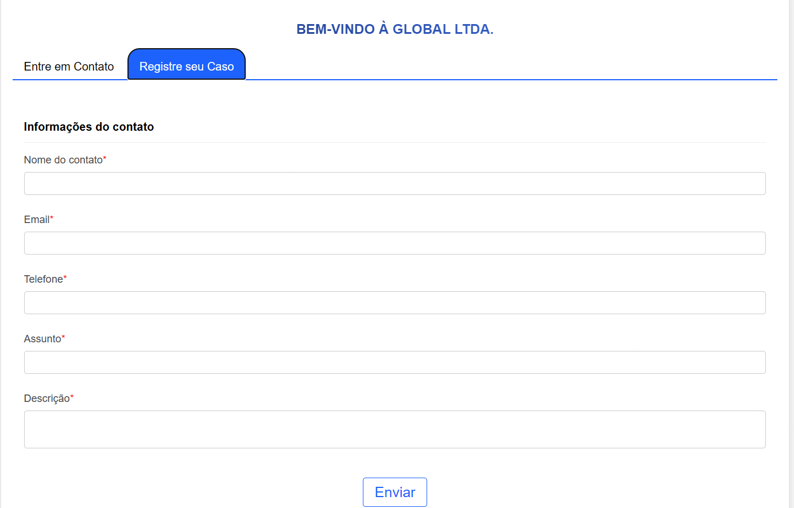
</div>

Além disso, foi criado um e-mail chamado `meajuda.global@gmail.com` que recebe e-mails e a partir deles cria casos para a fila de atendimento `Central Telefônica`.

Por fim, ao encerrar um caso, é enviado um formulário de satisfação através de um flow, com a seguinte interface:

<div align="center">
    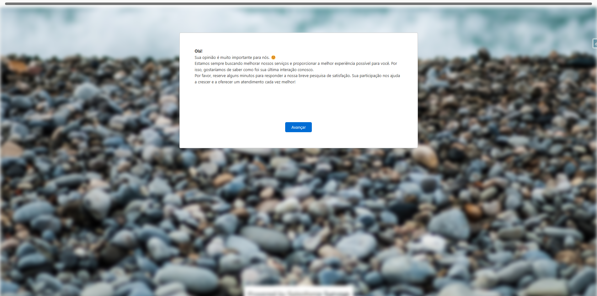
</div>

<div align="center">
    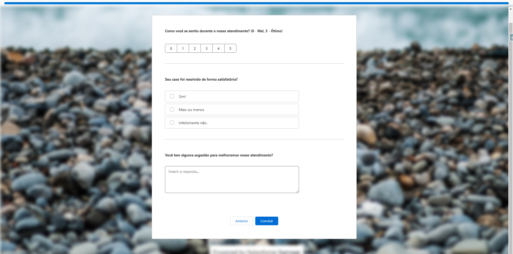
</div>

<div align="center">
    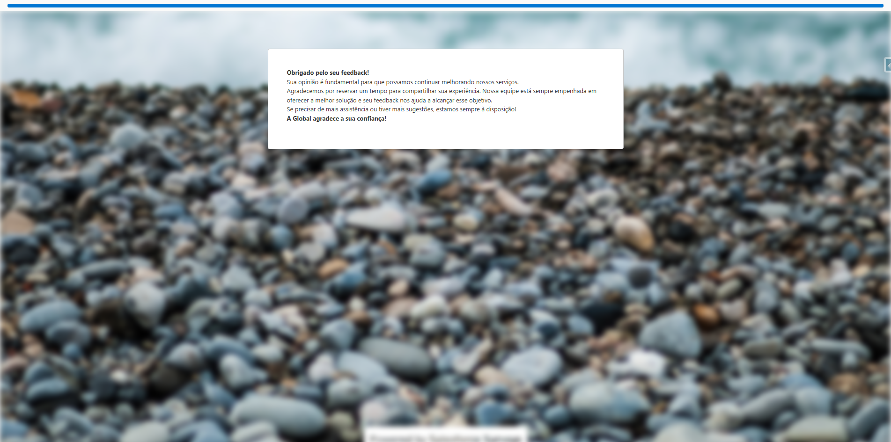
</div>

O formulário foi criado através do `Salesforce Surveys`, o que permite ver as análises na interface a seguir:

<div align="center">
    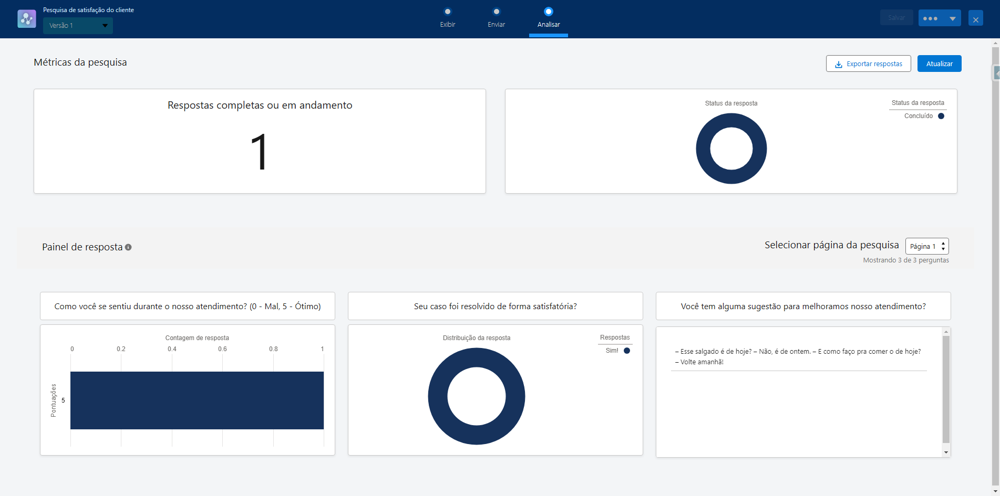
</div>

### 📊 Relatórios e Painéis

- **Desafio:** Realizar a criação de painéis para demonstrar os pontos:
1. Número de Leads por Status
2. Número de Leads por Origem
3. Top 10 Cidades com Mais Leads Convertidos
4. Top 10 Oportunidades Perdidas e seus Motivos
5. Funil de vendas com Número-
6. Taxa de Vendas (Negócios Ganhos vs Totais)

- **Solução:** Foi criado uma página inicial para o aplicativo `Global App` contendo os 6 gráficos e seus relatórios, conforme a foto a seguir:

<div align="center">
    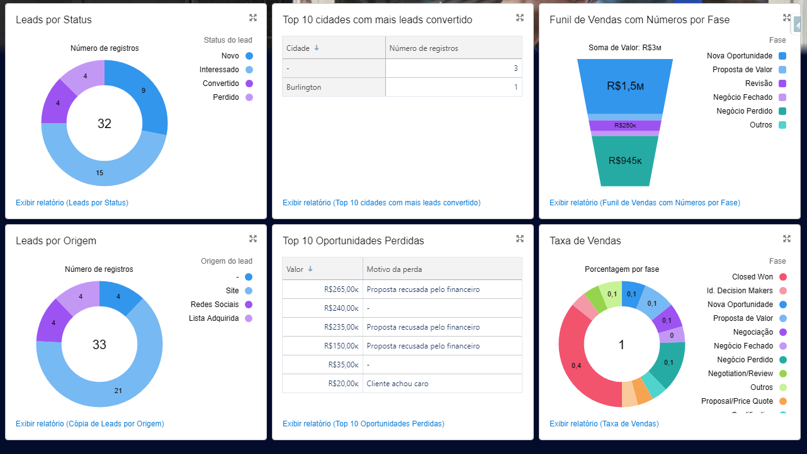
</div>

#### 🔧 Funcionalidades Adicionais em LWC e Apex

##### 🗺️ 1. Google Maps Integration

-- **Desafio: Criar um componente LWC que se conecte à API do Google Maps no Salesforce para exibir localizações com base em dados de endereço.

Solução: Foi implementado um componente LWC que visualiza localizações no mapa com base no endereço. Sempre que uma nova conta é criada, o componente exibe no mapa um ponto indicando a localização correspondente.

##### 💳 2. Gerador de Cotação em PDF

- **Desafio:** Criar um componente LWC onde o usuário pode selecionar produtos de uma oportunidade e gerar um PDF com a cotação.

- **Solução**: Foi implementado um componente LWC com uma pré-visualização de uma oportunidade e seus produtos. O componente tem um botão 'Exportar' que ao ser clicado gera um PDF de forma dinâmica e o salva no computador do usuário com o nome `C-{Nome_da_oportunidade}-{DD-MM-ANO}.pdf`

O componente tem essa interface:

<div align="center">
    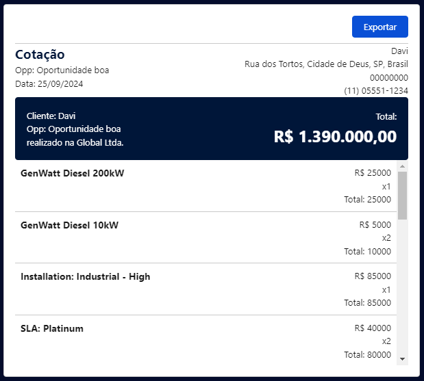
</div>

Os produtos da oportunidade são chamados através de uma pesquisa SOQL realizada em uma classe Controller em Apex, além disso, o registro de oportunidade e da conta relacionada são chamados através do método getRecord da biblioteca nativa do Lightning.

```SQL
SELECT Id, Product2.Name, TotalPrice, Quantity, UnitPrice FROM OpportunityLineItem WHERE OpportunityId = :oppId
```

Ao apertar o botão, o PDF é gerado com a seguinte interface:

<div align="center">
    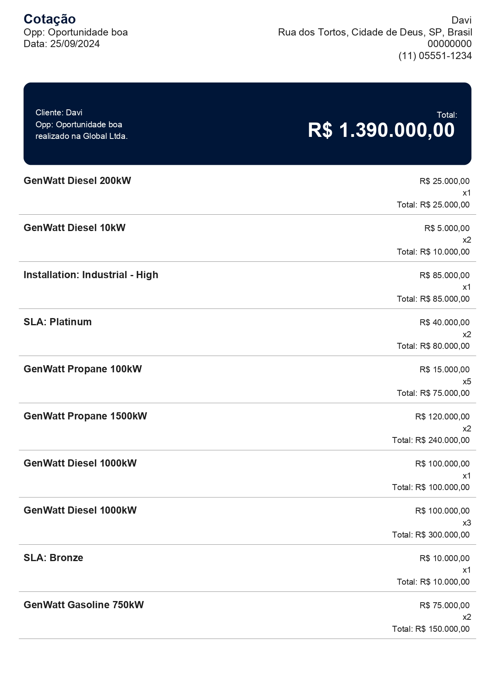
</div>

Vale destacar, que há o controle de espaço em branco na página, adicionando páginas caso necessário, permitindo visualização total do pedido, independente de seu tamanho. 

```javascript
if (restingHeight < 0) {
    doc.addPage();
    atualHeight = 20;
    restingHeight = pageHeight - atualHeight - 20; //pageHeight = 297
}
```

Além disso, há uma verificação se a conta existe sempre antes da tentativa de imprimir seus dados, impedindo que ocorram erros e garantindo o pleno funcionamento do componente.

```javascript
if(this.account){
    doc.text(`Cliente: ${this.account.fields.Name.value}`, 15, startHeight + 14, {
        maxWidth: 190,
    })
}
```

##### 🧮 3. Calculadora Customizável

- **Desafio:** O objetivo é construir um componente LWC que simule uma calculadora básica, permitindo as operações de adição, subtração, divisão, multiplicação e raiz quadrada.

- **Solução:** Foi implementado um componente LWC utilizando HTML, CSS e JavaScript para a lógica para representar o layout típico de uma calculadora com botões numéricos e de operação.

<div align="center">
    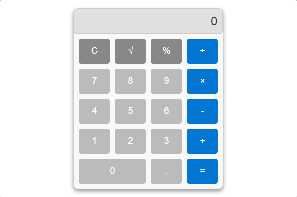
</div>

##### 🤝 5. Últimos Leads Gerados

- **Desafio:** O desafio consistia em criar uma tela utilizando Lightning Web Component (LWC) em conjunto com o Apex, com a finalidade de exibir uma lista dos últimos leads criados no Salesforce.

- **Solução:** A solução proposta foi o desenvolvimento de um componente LWC integrado ao Apex, onde o Apex é responsável por buscar os dados dos leads diretamente da base de dados do Salesforce e retorná-los ao LWC.

<div align="center">
    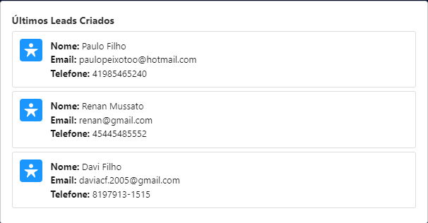
</div>

#### 📲 6. Últimos Contatos Criados

- **Desafio:** O desafio consistia em criar uma tela utilizando Lightning Web Component (LWC) em conjunto com o Apex, com a finalidade de exibir uma lista dos últimos contatos criados no Salesforce.

- **Solução:** A solução proposta foi o desenvolvimento de um componente LWC integrado ao Apex, onde o Apex é responsável por buscar os dados dos contatos diretamente da base de dados do Salesforce e retorná-los ao LWC.

<div align="center">
    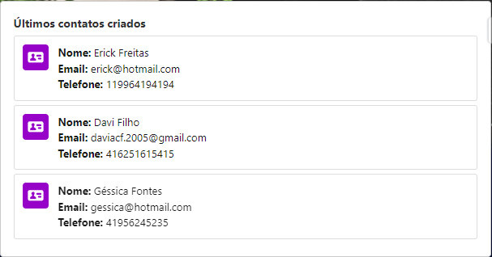
</div>

# Fluxo 2 - Alocação do Vem Ser

## ☑️ Objetivo

Gerenciar e automatizar as tarefas relacionadas às alocações do ramo de tecnologia realizadas pela DBC Company. Inicialmente, o foco está no Programa Vem Ser DBC, uma iniciativa voltada para a formação e alocação de profissionais de tecnologia.

### ❕ Escopo Principal

#### 📦 Objetos Customizados

##### 🧑‍⚕️ 1. Profissional

O objeto Profissional (Professional__c) é responsável por armazenar informações detalhadas sobre os profissionais, sejam eles estagiários ou já contratados. Este objeto é dividido em dois tipos de registro, possibilitando a categorização diferenciada entre estagiários e funcionários contratados. 
   
   - **Campos:**
**- Add_Another_Formation__c (Texto 100):** Inserir informações sobre formações adicionais que a pessoa possa ter.

**- Professional_Allocation__c (Pesquisa Alocação):** Selecionar a alocação atual do profissional dentro da organização.

**- Active__c (Caixa de seleção):** Indica se o registro está ativo ou inativo.

**- Bolsa__c (Moeda 16,2):** Campo para indicar o valor da Bolsa Auxílio.

**- Positions__c (Lista de opções):** Campo para selecionar os cargos ocupados pelo profissional dentro da organização.

**- City__c (Área de texto 255):** Campo para inserir a cidade de residência ou atuação do profissional.

**- Hired__c (Fórmula Caixa de seleção):** Indica se o profissional foi contratado, calculado através de uma fórmula baseada em outros campos.

**- Contract_Extension__c (Caixa de seleção):** Indica se o contrato do profissional foi estendido.

**- Mentoring_start_data__c (Data):** Campo para registrar a data de início de um programa de mentoria.

**- Birthdate__c (Data):** Campo para registrar a data de nascimento do profissional.

**- Mentoring_end_date__c (Data):** Campo para registrar a data de término de um programa de mentoria.

**- Contract_End_Date__c (Data):** Campo para registrar a data de término do contrato do profissional.

**- Contract_Start_Date__c (Data):** Campo para registrar a data de início do contrato do profissional.

**- Targeted__c (Caixa de seleção):** Campo que indica se o profissional foi alvo de alguma ação ou programa específico.

**- Vem_Ser_Edition__c (Lista de opções):** Campo para selecionar a edição do programa Vem Ser que o profissional participou.

**- Email__c (Email Exclusivo):** Campo para registrar o e-mail do profissional, garantindo que não seja duplicado.

**- Address__c (Área de texto 255):** Campo para inserir o endereço residencial ou profissional do indivíduo.

**- Specify_Training__c (Lista de opções):** Campo para detalhar formações complementares que o profissional possa ter realizado.

**- State__c (Lista de opções):** Campo para selecionar o estado de residência ou atuação do profissional.

**- Intern__c (Fórmula Caixa de seleção):** Campo que indica, através de uma fórmula, se o profissional é um estagiário.

**- Additional_training__c (Caixa de seleção):** Campo que indica se o profissional possui formações complementares.

**- Manager__c (Pesquisa Profissional):** Campo para associar o profissional ao seu gestor direto.

**- Mentor__c (Pesquisa Profissional):** Campo para associar o profissional ao seu mentor no programa de mentoria.

**- Active_Mentoring__c (Caixa de seleção):** Campo que indica se atualmente existe um processo de mentoria ativo para o profissional.

**- Name (Texto 80):** Campo para inserir o nome completo do profissional.

**- Observations__c (Área de texto 255):** Campo para adicionar quaisquer observações pertinentes sobre o profissional ou o registro.

**- OwnerId (Pesquisa Usuário,Grupo):** Campo que identifica o usuário ou grupo proprietário do registro.

**- Extension_Months__c (Número 18,0):** Campo para registrar a quantidade de meses que o contrato foi estendido.

**- Work_Regime__c (Lista de opções):** Campo para selecionar o regime de trabalho do profissional, como CLT, estágio, etc.

**- Salary__c (Moeda 16,2):** Campo para registrar o salário do profissional, permitindo cálculos e ajustes financeiros.

**- Stacks__c (Lista de opções seleção múltipla):** Campo para selecionar as tecnologias ou competências técnicas que o profissional domina.

**- Tecnology__c (Lista de opções seleção múltipla):** Campo para selecionar as tecnologias específicas com as quais o profissional tem experiência.

**- Phone__c (Telefone):** Campo para registrar o número de telefone do profissional.

**- Has_Child__c (Caixa de seleção):** Indica se o profissional tem filhos.

**- RecordTypeId (Tipo de registro):** Campo usado para diferenciar entre diferentes tipos de registros dentro do sistema.

**- Trail_Vem_Ser__c (Lista de opções):** Campo para selecionar a trilha específica do programa Vem Ser que o profissional seguiu.

**- Machine_Use__c (Lista de opções):** Campo para indicar o nível de uso de máquinas ou equipamentos pelo profissional dentro da organização.

Além desses campos, esse objeto também tem campos relacionados a avaliações de habilidades adquiridas no Vem Ser, baseado nas trilhas. São eles:

**- Softskills:**
1. Adaptability__c
2. Self_management__c
3. Self_learning__c
4. Communication__c
5. Time_management__c
6. Leadership__c
7. Problem_solving__c
8. Teamwork__c

**- Essencial:**
1. Git__c
2. Docker__c
3. SQL__c

**- Front:**
1. HTML5__c
2. CSS3__c
3. JavaScript__c
4. TypeScript__c
5. ContextAPI__c
6. Redux__c
7. StyledComponents__c
8. React__c
9. Angular__c

**- Back:**
1. SpringWeb__c
2. SpringData__c
3. SpringSecurity__c
4. TDD__c
5. JUnit__c
6. Mockito__c
7. NoSQL__c
8. Kafka__c

**- QA:**
1. Testes_Ageis__c
2. Testes_de_API__c
3. Testes_de_UI__c
4. Teste_de_Performance__c

**- Dados:**
1. DataBricks__c
2. Python__c
3. Spark__c
4. Dax__c
6. B_I__c

**- Salesforce:**
1. SF_Admin__c
2. Flow__c
3. Apex__c
4. VisualForce__c
5. Aura__c
6. LWC__c

O profissional pode ser de dois tipos, são eles: Estagiário e Contratado

<div align="center">
    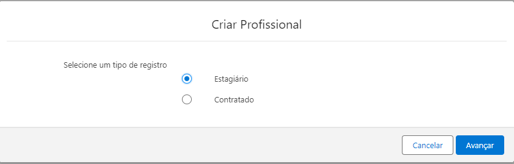
</div>

##### 📂 2. Profissional Arquivado

Esse campo contém exatamente os mesmos campos que o Objeto Profissional, mas sua função é armazenar registros criados há mais de 3 meses.

##### 🤝 3. Alocação

O objeto Alocação (Allocation__c) é responsável por armazenar informações detalhadas sobre as alocações, realizando a junção entre o objeto Cliente e o objeto Profissionais. Este objeto possui a função de visualizar o direcionamento do profissional conforme suas alocações, dessa forma ajudando a empresa a gerar relatórios e melhorar as visualizações dos registros.

- **Campos:**
    - **Client__c (Lista de opções):** Cliente em que está alocado

    - **Start_Date__c (Data):** Data de início da Alocação

    - **End_date_Allocation__c (Data):** Data fim da Alocação

    - **Start_Date_Client__c (Data):** Data início no Cliente

    - **Manager__c (Pesquisa Profissional):** Gestor

    - **Name (Numeração automática):** ID de Alocação

    - **Observations__c (Área de texto 255):** Observações sobre a alocação

    - **Other_Technolgys__c (Texto 255):** Outras Tecnologias

    - **Needs_Additional_Training__c (Caixa de seleção):** Precisa de formação complementar

    - **Professional__c (Pesquisa Profissional):** Profissional alocado

    - **Stack_allocation__c (Lista de opções):** Stack em que trabalhará na alocação

    - **Stack_training__c (Fórmula Texto):** Stack realizada na formação

    - **Status__c (Lista de opções):** Status

    - **Technology__c (Lista de opções seleção múltipla):** Tecnologia

    - **Vem_Ser_Edition__c (Lista de opções):** Edição do Vem Ser em que participou

##### 🧑‍💼 4. Cliente

O objeto Cliente (Cliente__c) é responsável por armazenar informações sobre os clientes que estejam ofertando de vagas e possuam interesse na alocação de profissionais pela DBC.

- **Campos:**
    - **CNPJ__c (Texto(20)):** Campo para inserir o CNPJ do cliente.
    - **Data_de_Cadastro__c (Data):** Identifica a data de cadastro do registro.
    - **E_mail (Email):** Campo para inserir o e-mail do cliente.
    - **Endere_o__c (Texto(50)):** Campo para inserir o endereço do cliente.
    - **Name (Texto(80)):** Campo para inserir o nome do cliente.
    - **Nota__c (Área de texto longo(32768)):** Campo para observações/anotações relacionadas ao cliente.
    - **Stat__c (Lista de opções):** Indica se o registro está ativo ou inativo.
    - **Telefone__c (Telefone):** Campo para inserir o telefone do cliente.
    - **Tipo_de_Cliente__c (Lista de opções):** Campo que indica o tipo ou relevância do cliente para a empresa.
    - **Vaga__c (Pesquisa(Vaga)):** Campo para inserir o relacionamento com a vaga do cliente.
    - **Open_Positions__c (Resumo da totalização (COUNT Vaga)):** Campo que indica a quantidade total de vagas em aberto relacionadas ao cliente.
    - **Total_Positions__c (Resumo da totalização (COUNT Vaga)):** Campo que indica a quantidade total de vagas já abertas do cliente.

##### 🎖️ 5. Vagas

O  objeto Vagas (Vacany__c) é responsável por armazenar informações sobre as Vagas que estejam oferecidas pelos clientes da DBC e abrange dados relevantes para a gestão e o acompanhamento de oportunidades de trabalho, facilitando a busca por candidatos qualificados e a otimização do processo de recrutamento. 

- **Campos:**

    - **Client__c (Detalhes do mestre(Cliente)):** Nome da empresa ou cliente que está oferecendo a vaga.
    - **Expiration_Date__c (Data):** Data em que a vaga será expirada e não estará mais disponível.
    - **Publication_Date__c (Data):** Data em que a vaga foi publicada.
    - **Job_Description__c (Área de texto longo(32768)):** Detalhes e informações sobre as responsabilidades e requisitos da vaga.
    - **VemSer_Edition__c (Lista de opções):** Edição específica do programa "Vem Ser" associada à vaga.
    - **Required_Skills__c (Área de texto longo(32768)):** Conjunto de habilidades e competências necessárias para a vaga.
    - **Location__c (Texto(200)):** Local onde o trabalho será realizado, podendo incluir cidade e/ou país.
    - **Name (Texto(80)):** Título ou nome da posição oferecida.
    - **Vacancy_Observation__c (Área de texto longo(32768)):** Comentários adicionais ou notas sobre a vaga.
    - **Responsabilities__c (Área de texto longo(32768)):** Principais responsabilidades e tarefas associadas à vaga.
    - **Stack__c (Texto(255)):** Tecnologias e ferramentas que serão utilizadas no trabalho.
    - **Vacancy_Status__c (Lista de opções):** Situação atual da vaga (aberta, fechada, em processo, etc.).
    - **Job_Type__c (Lista de opções):** Categoria do emprego (tempo integral, meio período, estágio, etc.).
    - **Open_Vacancies__c (Número(16, 0)):** Número de posições disponíveis para a vaga.

#### 🤖Funcionalidades de Automação

##### 📓 1. Criação de Resumo do Profissional

Em um profissional Estagiário, ao acessar um registro é permitido gerar automaticamente um resumo de seu perfil, caso todos os campos visualizados na imagem abaixo estejam preenchidos (em verde).

<div align="center">
    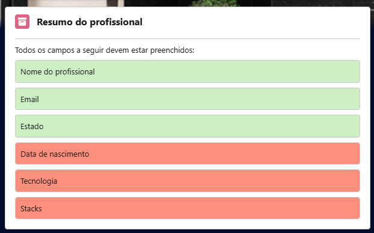
</div>

Gerando um resumo que pode ser exportado em PDF, como o a seguir:

<div align="center">
    
</div>

##### 🟢 2. Envio de Feedback

É possível enviar um feedback para um profissional através da interface a seguir, podendo ele ser anônimo ou não.

<div align="center">
    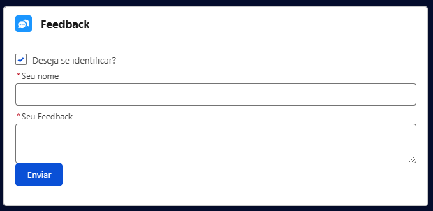
</div>

##### 📴 3. Flow para Profissionais Inativos

Esse Flow impede que profissionais inativos sejam adicionados a alocações ou que alocações com profissionais inativos sejam editadas.

<div align="center">
    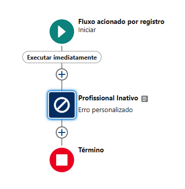
</div>

##### 🗃️ 4. Flow para Atualização de Estagiários

Esse Flow desliga automaticamente estagiários que não estejam alocados após 30 dias do início do processo de alocação, além disso, solicita uma revisão contratual após 21 dias desta mesma data.

<div align="center">
    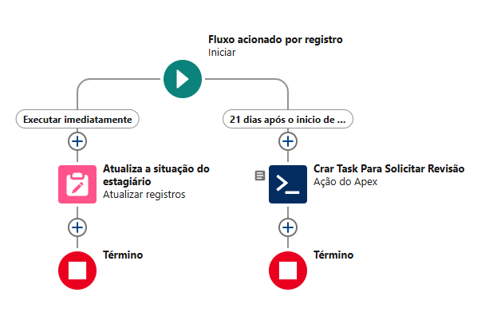
</div>

##### ⚙️ 5. Flow para Fechar Vagas

Ao todas as vagas serem preenchidas (Vagas Abertas forem igual a 0), o status da vaga é mudada para fechada.

<div align="center">
    
</div>
